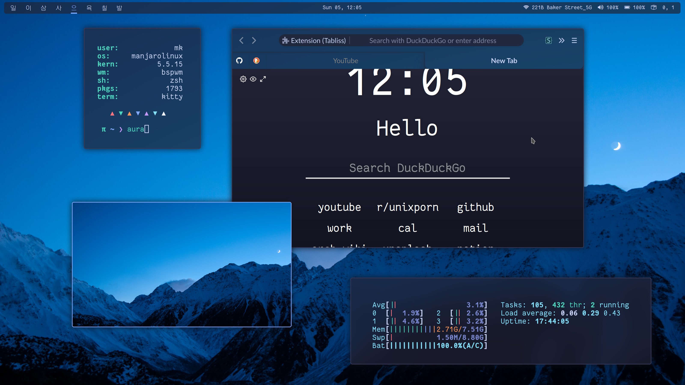

## CaptainEureka's personal config files

This is a collection of my personal configuration files.
I'm currently using Manjaro with ~~i3-gaps-rounded~~ `bspwm` (rounded fork) and KDE/Plasma (until I properly configure multi-monitor support ...)

Some details about my setup:

- **WM**: ~~[i3-gaps-rounded](https://github.com/resloved/i3/) ([AUR](https://aur.archlinux.org/packages/i3-gaps-rounded-git/))~~ -> moved to [bspwm-rounded-corners](https://github.com/dylanaraps/bspqwm)([AUR](https://aur.archlinux.org/packages/bspwm-rounded-corners/)) patched by dylanaraps
- **DE**: [KDE/Plasma](https://kde.org/plasma-desktop)
- **Compositor**: [picom]() (with `dual-kawase` blur)
- **OS**: Manjaro
- **Shell**: [zsh](https://wiki.archlinux.org/index.php/Zsh)
  - Using: [oh-my-zsh](https://github.com/ohmyzsh/ohmyzsh) with the [pi](https://github.com/tobyjamesthomas/pi) theme
- **Terminal Emulator**: [kitty](https://github.com/kovidgoyal/kitty/) / `Konsole`
- **Editor**: [Neovim](https://github.com/neovim/neovim/)
- **File Manager**: [ranger(https://github.com/ranger/ranger) / [thunar](https://git.xfce.org/xfce/thunar/)
- **Launcher/run**: [rofi](https://github.com/davatorium/rofi)
- **Bar**: [polybar](https://github.com/polybar/polybar)
- **Browser**: Firefox (with my personal [stylesheet](https://github.com/CaptainEureka/firefox-vibrancy))

### Fonts

- **Terminal**: `Fantasque Sans Mono`
- **Polybar**: `Fantasque Sans Mono`, `Hack Nerd Font Mono`
- **System**: `Lato`

###  Screenshots

| `i3-gaps-rounded` |                   |
| :---------------- | ------------------------------------------------- |
| `bspwm-rounded`   |  |
