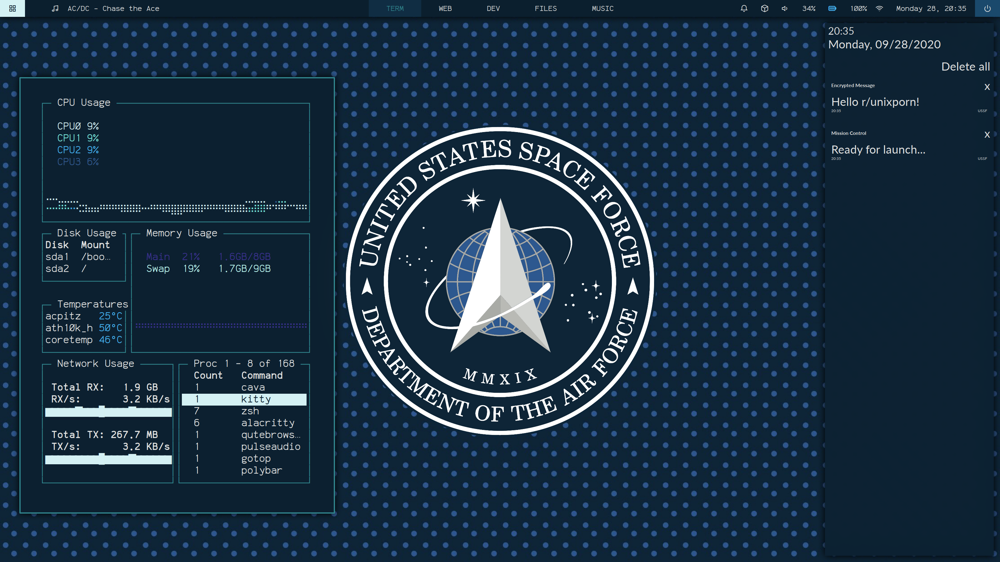
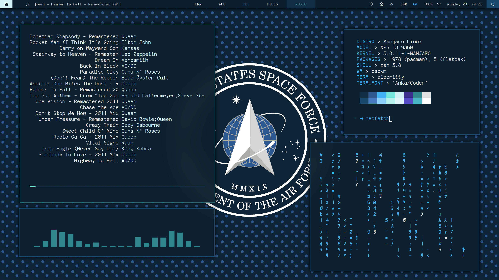
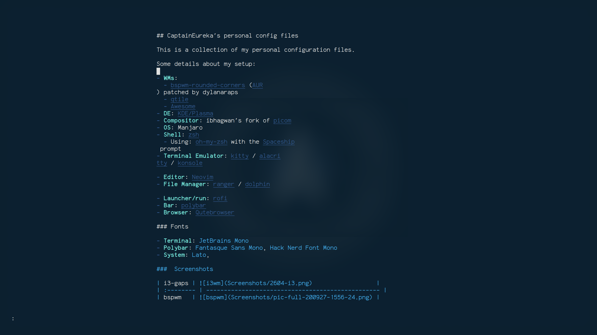
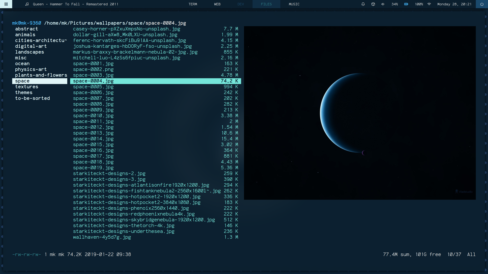
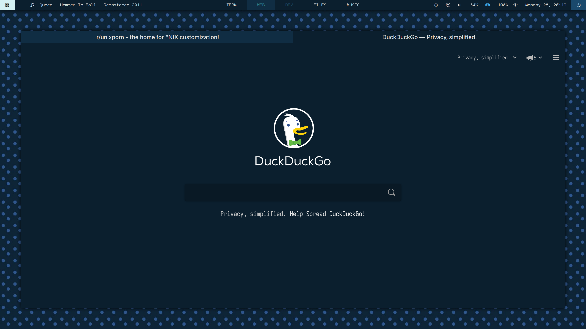

## Preview

### Some details about my setup:

- **OS**: Manjaro

- **WMs**: 
  - [bspwm-rounded-corners](https://github.com/dylanaraps/bspqwm) ([AUR](https://aur.archlinux.org/packages/bspwm-rounded-corners/)) patched by dylanaraps
  - [qtile](https://qtile.org)
  - [i3](i3wm.org)
- **DE**: [KDE/Plasma](https://kde.org/plasma-desktop)
- **Compositor**: ibhagwan's fork of [picom](https://github.com/ibhagwan/picom)
- **Shell**: [zsh](https://wiki.archlinux.org/index.php/Zsh)
  - Using: [oh-my-zsh](https://github.com/ohmyzsh/ohmyzsh) with the [Spaceship](https://github.com/denysdovhan/spaceship-prompt) prompt
- **Terminal Emulator**: [kitty](https://github.com/kovidgoyal/kitty/) / [alacritty](https://github.com/alacritty/alacritty) / [konsole](https://github.com/KDE/konsole)
- **Editor**: [Neovim](https://github.com/neovim/neovim/)
- **File Manager**: [ranger](https://github.com/ranger/ranger) / [dolphin](https://invent.kde.org/system/dolphin)
- **Launcher/run**: [rofi](https://github.com/davatorium/rofi)
- **Bar**: [polybar](https://github.com/polybar/polybar)
- **Browser**: [Qutebrowser](https://github.com/qutebrowser)
- **Wallpaper**: [here](.wallpapers/ussf-wallp.jpg)

### Fonts

- JetBrains Mono
- Share Tech Mono
- Anka/Coder
- SF Pro
- Icomoon - Feather
- Material Icons

## Setup

**Coming Soon!!**

###  Screenshots

* Fake busy

* Ranger

* Qutebrowser w/ them GAPS!!

* Clean

[Actual daily driver](Screenshots/pic-full-200927-1556-24.png)